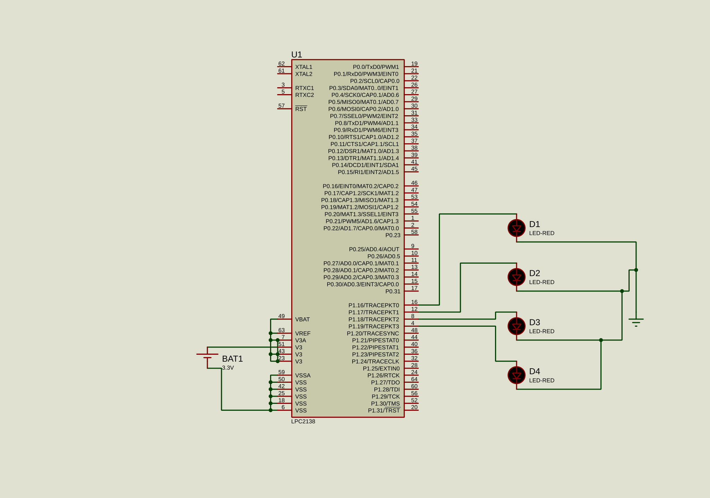

# Experiment 01: 4-LED Sequential Blinking

A program to interface **4 LEDs with the LPC2148 ARM7 microcontroller** using **Keil uVision 4**. The program blinks LED 1, LED 2, LED 3, and LED 4 sequentially in a continuous loop.

The circuit design and program logic are verified using **Proteus Professional**.

---

## Project Directory Structure

```text
01_LED_Sequential_Blink/
├── README.md                 # Markdown documentation file
├── circuit.svg               # Proteus circuit schematic (SVG)
├── code/                     # Keil uVision 4 project files
│   ├── main.c               # Main embedded C program
│   ├── Startup.s            # ARM7 startup assembly file
│   └── Project.uvproj       # Keil uVision 4 project file
└── simulation/               # Proteus simulation files
    └── circuit.pdsprj       # Proteus project file
```

---

## Circuit Schematic

<p align="center">
  <a href="./circuit.svg">
    
  </a>
</p>

The circuit schematic is available in the `circuit.svg` file located in the root directory of this experiment.

---

## Hardware Pin Connections

| Component Pin | LPC2148 Pin | Logic Type | Description |
|---|---|---|---|
| **LED 1 Anode (+)** | **P1.16** | Active-HIGH | Sequential Blinking Stage 1 |
| **LED 2 Anode (+)** | **P1.17** | Active-HIGH | Sequential Blinking Stage 2 |
| **LED 3 Anode (+)** | **P1.18** | Active-HIGH | Sequential Blinking Stage 3 |
| **LED 4 Anode (+)** | **P1.19** | Active-HIGH | Sequential Blinking Stage 4 |
| **LED Cathodes (-)** | **GND** | Ground | Connected through 330Ω current-limiting resistors |

### Pin Configuration

- **P1.16:** LED 1
- **P1.17:** LED 2
- **P1.18:** LED 3
- **P1.19:** LED 4
- **GPIO Direction:** Output
- **Logic HIGH:** LED ON
- **Logic LOW:** LED OFF

---

## Working Principle

1. The LPC2148 microcontroller configures pins **P1.16 to P1.19 as output pins**.
2. LED 1 turns ON while the other LEDs remain OFF.
3. LED 1 turns OFF, and LED 2 turns ON.
4. LED 2 turns OFF, and LED 3 turns ON.
5. LED 3 turns OFF, and LED 4 turns ON.
6. LED 4 turns OFF, and the sequence repeats continuously from LED 1.

Each LED is activated individually with a programmed time delay.

---

## Software Requirements

- **Microcontroller:** ARM7 LPC2148
- **IDE:** Keil uVision 4
- **Programming Language:** Embedded C
- **Simulation Software:** Proteus Professional
- **Assembly File:** Startup.s

---

## Files Description

| File | Description |
|---|---|
| `README.md` | Project documentation |
| `circuit.svg` | Circuit schematic |
| `code/main.c` | Embedded C source code |
| `code/Startup.s` | ARM7 startup assembly code |
| `code/Project.uvproj` | Keil uVision 4 project |
| `simulation/circuit.pdsprj` | Proteus simulation project |

---

## Expected Output

The four LEDs blink one after another in the following sequence:

**LED 1 → LED 2 → LED 3 → LED 4 → Repeat**

The sequence continues in an infinite loop.

---

## Verification

The program and circuit are tested using **Proteus Professional** to verify sequential LED operation and the correctness of the LPC2148 GPIO configuration.

---

## Author

**Devendra Kashyap**

B.Tech CSE (IoT)

ARM7 LPC2148 Embedded Systems Laboratory